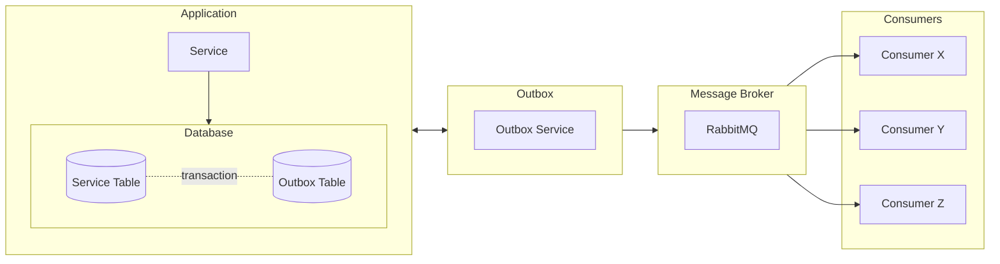

# outbox

## Architecture

```mermaid
flowchart LR
  subgraph a [Application]
    direction TB
    s[Service]
    subgraph db [Database]
        direction RL
        oDB[(Outbox Table)]
        sDB[(Service Table)]
        oDB -. transaction .- sDB 
    end
        s --> db
  end

  subgraph o [Outbox]
    direction LR
    os[Outbox Service]
  end

  subgraph mbr [Message Broker]
    direction LR
    mbrs[RabbitMQ]
  end

  subgraph c [Consumers]
  direction TB
  cX[Consumer X]
  cY[Consumer Y]
  cZ[Consumer Z]
  end
  a <--> o
  o --> mbr
  mbr --> cX
  mbr --> cY
  mbr --> cZ
```
